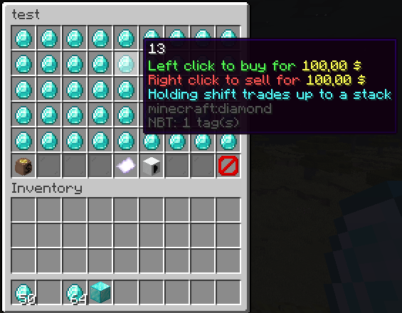

# About this fork

This is a fork of the original [GUI Shop](https://github.com/UnsafeDodo/gui-shop) mod by [UnsafeDodo](https://github.com/UnsafeDodo).
I adapted it to my requirements and added some features.
I'm not planning to provide support _(at this time)_, but feel free to use or fork it if you want.

# GUI Shop

A fabric server-side mod to create and manage GUI shops.
They can be later opened by using commands, allowing integration with NPC mods like [Taterzens](https://www.curseforge.com/minecraft/mc-mods/taterzens).
<br>The mod supports [LuckPerms](https://www.curseforge.com/minecraft/mc-mods/luckperms) for permissions.

## Installation
Put the .jar file in the "mods" folder

**(Requires [Fabric API](https://www.curseforge.com/minecraft/mc-mods/fabric-api) and (optionally) [a supported Economy](#supported-economies))**
<br><br>

## Commands and permissions
All commands can be used by admins (permission level 3) or by users/groups with the specific permission


| Description                       | Command                                                                                | Permission               | 
|-----------------------------------|----------------------------------------------------------------------------------------|--------------------------|
| Main command                      | `/guishop`                                                                             | `guishop.main`           |
| Create a shop                     | `/guishop create <shopName>`                                                           | `guishop.create`         |
| Delete a shop                     | `/guishop delete <shopName> `                                                          | `guishop.delete`         |
| Add an item in a shop             | `/guishop additem <shopName> <itemId> <buyPrice> <sellPrice> <currency> <description>` | `guishop.additem`        |
| Remove an item from a shop        | `/guishop removeitem <shopName> <itemName>`                                            | `guishop.removeitem`     |
| Open a shop for a player          | `/guishop open <shopName> <playerName>`                                                | `guishop.open`           |
| List all shops                    | `/guishop list`                                                                        | `guishop.list`           |
| List all items in a shop          | `/guishop list <shopName>`                                                             | `guishop.list`           |
| Force save config                 | `/guishop forcesave`                                                                   | `guishop.forcesave`      |
| Reload config file                | `/guishop reload`                                                                      | `guishop.reload`         |
| Show balance for all currencies   | `/guishop balance`                                                                     | `guishop.balance`        |
| Show balance for a currency       | `/guishop balance <currency>`                                                          | `guishop.balance`        |
| Send your money to another player | `/guishop balance <currency> send <playerName> <amount>`                               | `guishop.balance.send`   |
| Increase a player's balance       | `/guishop balance <currency> add <playerName> <amount>`                                | `guishop.balance.add`    |
| Decrease a player's balance       | `/guishop balance <currency> remove <playerName> <amount>`                             | `guishop.balance.remove` |

### Commands examples
Create a shop: `/guishop create "Test shop"`"

Add item in a shop: `/guishop additem "Diamond" minecraft:diamond[minecraft:enchantment_glint_override=true,minecraft:custom_name=hello] 250 100 guishop:credit "This is a Diamond\\An expensive diamond\\Shiny"` *(you can split each description line by using "\\\\")*

> Item components are supported in the same way as in the `/give` command.
You can use an item generator like [mcstacker](https://mcstacker.net/) or the one from
[Gamergeeks](https://www.gamergeeks.net/apps/minecraft/give-command-generator)
to generate items with components like enchantments, custom names, etc.
In-game, you'll also get suggestions for item components.

> The buy and sell prices are without any formatting so say you configured 2 decimal places in your config
> and you want to sell an item for 1.50, you would use 150 as the sell price.

Remove item from shop: `/guishop removeitem "Test shop" "Diamond"`

Open a shop and show it to a specific player: `/guishop open "Test shop" "Steve"`

You can also add items only to be bought or sold in a shop.
Items with a buy price of -1 can only be sold and items with a sell price of -1 can only be bought.

## Economy configuration
Guishop has a built-in optional economy provider that can be configured in the `./config/guishopeconomy.json` file.


### Economy provider configuration example
```json5
{
  "disabled": false,
  "database": {
    "type": "sqlite",
    "currency": "./config/guishop.sqlite"
  },
  "economy": {
    "currencies": {
      "credit": {
        "name": "Credits",
        "prefix": "$",
        "suffix": "",
        "decimalPlaces": 2,
        "icon": "minecraft:diamond"
      }
    },
    "accounts": {
      "account": {
        "name": "Account",
        "currency": "credit",
        "icon": "minecraft:diamond"
      }
    }
  },
  "command": {
    "disabled": false,
    "alias": ""
  }
}
```

## Guishop configuration
You can find the main config file in `./config/guishop.json`.

In `economyProviders` you can specify the economy provider you want to use.
This can be an external economy mod that uses the [Common Economy API](https://github.com/Patbox/common-economy-api)
or the built-in economy provider configured in `guishopeconomy.json`.
The object is a mapping usually `mod_id:currency_id` to a list of `account_id`'s.
To use the build-in economy provider, prefix your configured currency with `guishop:`.

In `shops` you can define your shops and their items.
Both the items' names and descriptions support [Simplified Text Format](https://placeholders.pb4.eu/user/text-format/).
You can both use the config file and in-game commands to add items to the shop.

Just remember to:
- reload the mod using `/guishop reload` after editing the config file,
- save the in-game changes using `/guishop forcesave` to reflect them in the config file.
- not to work in both the config file and in-game at the same time.
  - If the in-game changes are saved, they will overwrite any changes made to the config file.
  - If the config file is reloaded, it will overwrite any in-game changes.
  - Be careful when making large-scale changes to the config file while the server is running
    as the mod will automatically save in-game changes every 30 minutes.

### JSON example
```json5
{
  "economyProviders": {
    "guishop:credit": [
      "account"
    ]
  },
  "shops": [
    {
      "shopName": "Shop number one",
      "items": [
        {
          "name": "The boat",
          "itemId": "minecraft:acacia_chest_boat",
          "description": [
            "This is a nice boat",
            "Very beautiful"
          ],
          "buyPrice": 50,
          "sellPrice": 25,
          "currency": "guishop:credit",
          "componentChanges": {}
        },
        {
          "name": "Free BBQ Sword",
          "itemId": "minecraft:diamond_sword",
          "description": [],
          "buyPrice": 0,
          "sellPrice": -1,
          "currency": "guishop:credit",
          "components": {
            "minecraft:enchantment_glint_override": true,
            "minecraft:custom_name": "\"hello\""
          }
        },
        {
          "name": "Amethyst",
          "itemId": "minecraft:large_amethyst_bud",
          "description": [
            "<red>Such a spectacular</red>",
            "<purple>amethyst</purple>",
            "<rainbow>SHINY</rainbow>"
          ],
          "buyPrice": 200,
          "sellPrice": 100,
          "currency": "guishop:credit",
          "components": {}
        }
      ]
    },
    {
      "shopName": "A second shop",
      "items": []
    }
  ]
}
```

## Supported Economies:
From 1.4.5 and onwards, the mod supports any (combination of) economy mod that uses the [Common Economy API](https://github.com/Patbox/common-economy-api).
A great example is [Common Bridge](https://modrinth.com/mod/common-bridge), which bridges multiple economy plugins to use the Common Economy API.

GuiShop also comes with its own economy provider which can be configured in the config file.
This build-in economy provider can be configured with multiple currencies and accounts.
_(The multi-account per currency functionality has not been properly implemented yet.)_

## Showcase

