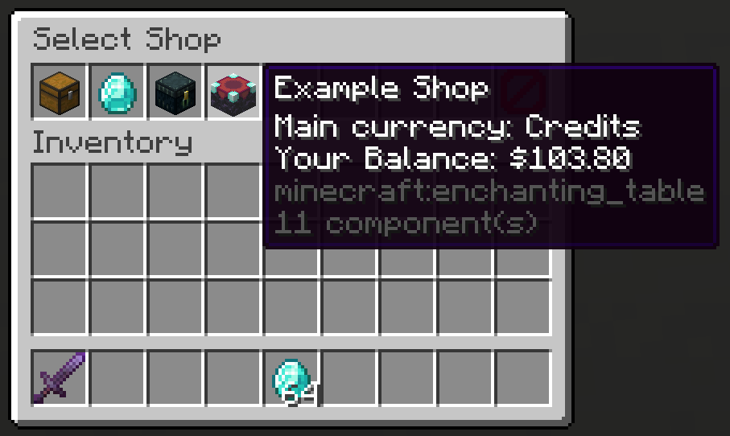
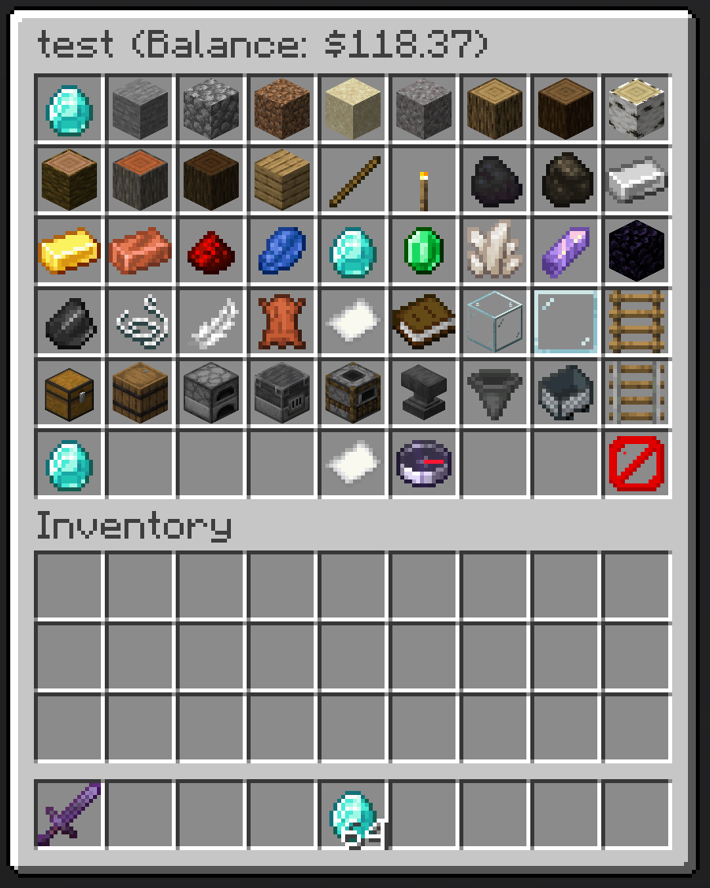
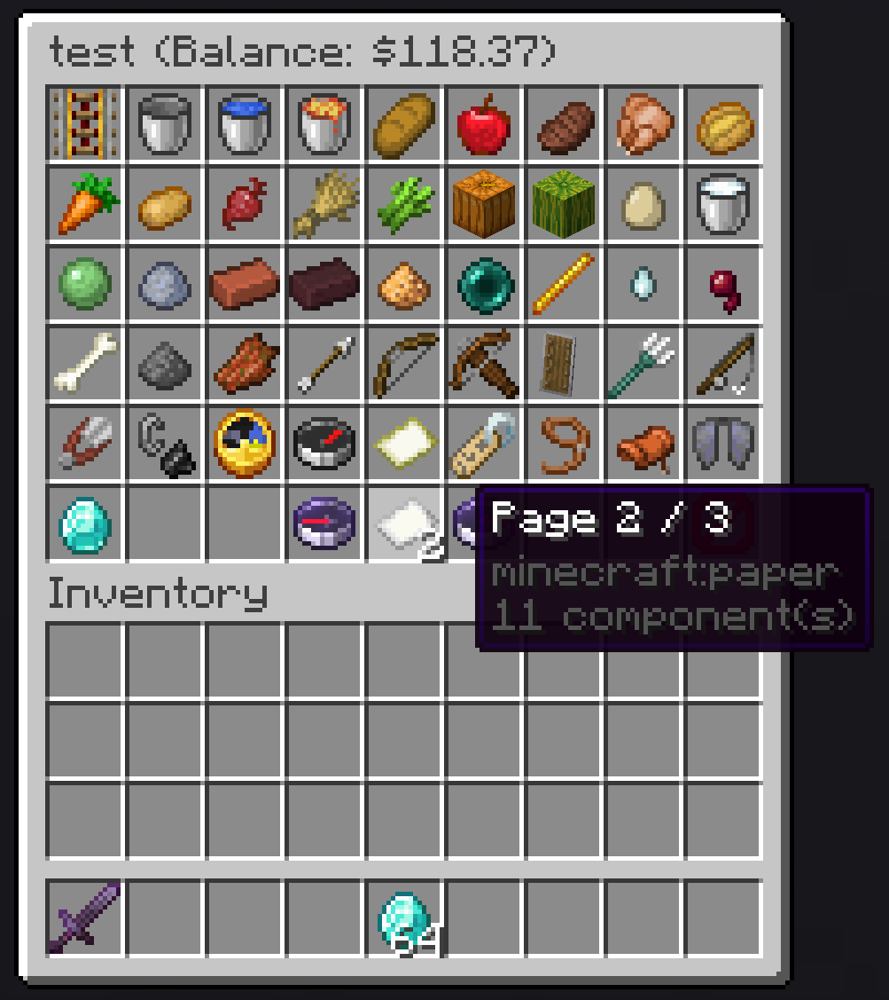
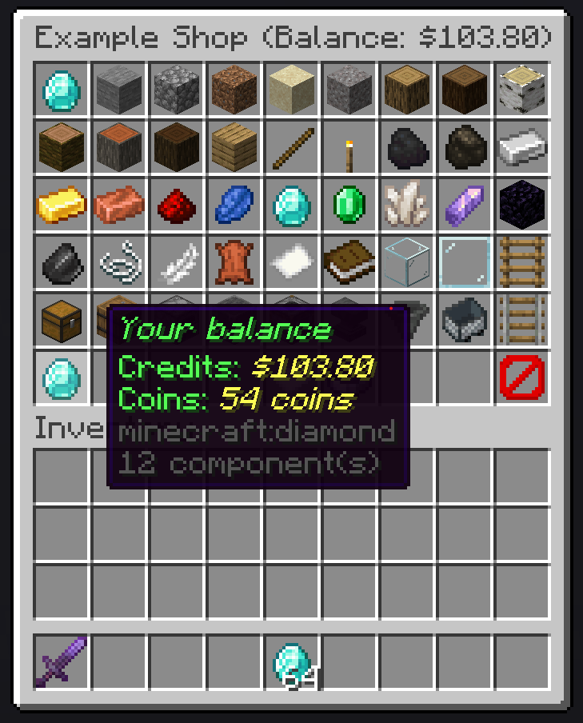
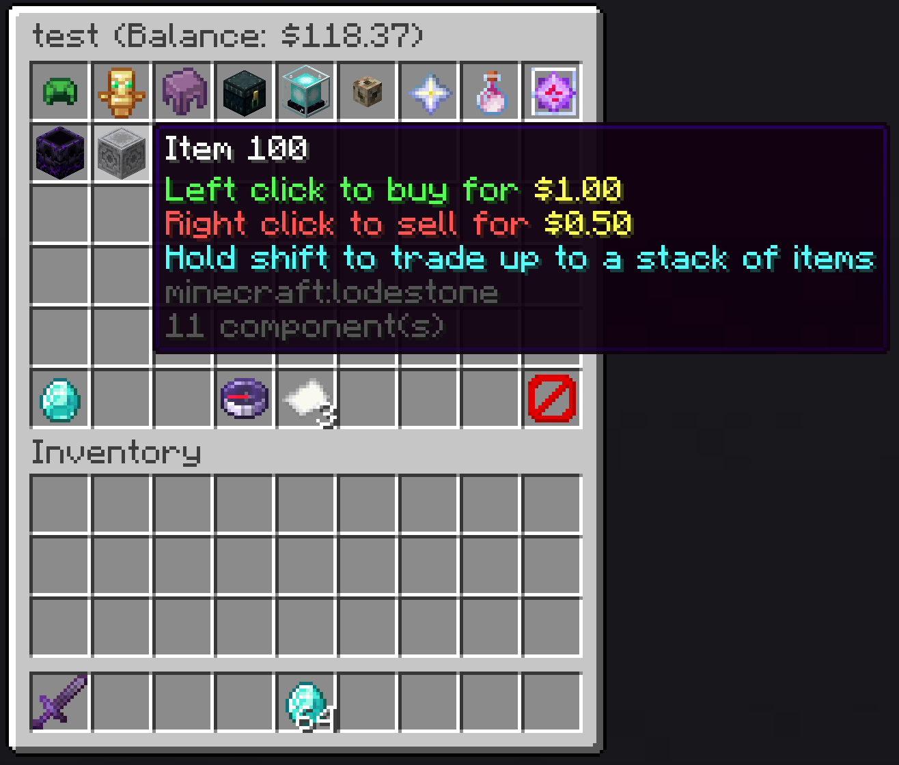
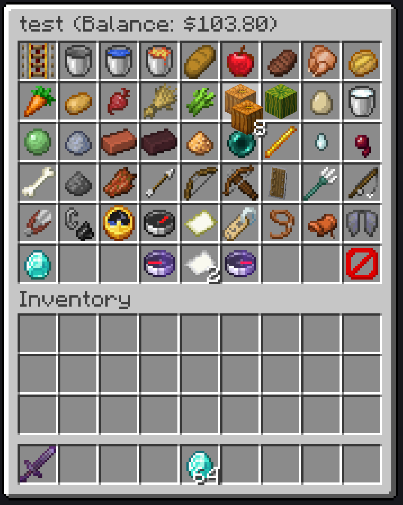

# GUI Shop

GuiShop is a Fabric server-side mod to create and manage GUI shops in Minecraft.
It comes with its own economy but also integrates seamlessly with other economy providers.
GuiShop is based on the works of [UnsafeDodo](https://github.com/UnsafeDodo), adapted and extended to fit my needs.

## Features

**Support for multiple shops**


**Sell as many items you want**


**Shop view supports pagination**


**Support for multiple balances**


**Buy and sell one or multiple items at once**


**Bought items appear in your cursor**


Other notable features:
- Drag and drop any items from your inventory to the shop. If it can be sold, it will be sold.
- Shop items support item components (enchantments, custom names, custom model data, etc.).
  - Note: Selling (inventory -> shop) items with enchantments is not supported yet.
- Supports multiple currencies, each item can be configured to use a different currency.
- Supports any economy mod that implements the [Common Economy API](https://github.com/Patbox/common-economy-api).
- Has its own built-in economy provider that can be configured with multiple currencies and accounts.
  - These currencies can be used by other mods that use the Common Economy API.
  - Has commands to manage balances (view, send, add, remove).
  - Can simulate any real-life currency by configuring prefix, suffix, decimal places and an icon.
- Shops can be opened through commands, allowing integration with NPC mods like [Taterzens](https://www.curseforge.com/minecraft/mc-mods/taterzens).
- The mod supports [LuckPerms](https://www.curseforge.com/minecraft/mc-mods/luckperms) for permissions.

## Installation
Put the .jar file in the "mods" folder

**(Requires [Fabric API](https://www.curseforge.com/minecraft/mc-mods/fabric-api) and (optionally) [a supported Economy](#supported-economies))**
<br><br>

## Commands and permissions
All commands can be used by admins (permission level 3) or by users/groups with the specific permission


| Description                             | Command                                                                                | Permission               | 
|-----------------------------------------|----------------------------------------------------------------------------------------|--------------------------|
| Main command, opens shop selection menu | `/guishop`                                                                             | `guishop.main`           |
| Create a shop                           | `/guishop create <shopName>`                                                           | `guishop.create`         |
| Delete a shop                           | `/guishop delete <shopName> `                                                          | `guishop.delete`         |
| Add an item in a shop                   | `/guishop additem <shopName> <itemId> <buyPrice> <sellPrice> <currency> <description>` | `guishop.additem`        |
| Remove an item from a shop              | `/guishop removeitem <shopName> <itemName>`                                            | `guishop.removeitem`     |
| Open a shop for a player                | `/guishop open <shopName> <playerName>`                                                | `guishop.open`           |
| List all shops                          | `/guishop list`                                                                        | `guishop.list`           |
| List all items in a shop                | `/guishop list <shopName>`                                                             | `guishop.list`           |
| Force save config                       | `/guishop forcesave`                                                                   | `guishop.forcesave`      |
| Reload config file                      | `/guishop reload`                                                                      | `guishop.reload`         |
| Show balance for all currencies         | `/guishop balance`                                                                     | `guishop.balance`        |
| Show balance for a currency             | `/guishop balance <currency>`                                                          | `guishop.balance`        |
| Send your money to another player       | `/guishop balance <currency> send <playerName> <amount>`                               | `guishop.balance.send`   |
| Increase a player's balance             | `/guishop balance <currency> add <playerName> <amount>`                                | `guishop.balance.add`    |
| Decrease a player's balance             | `/guishop balance <currency> remove <playerName> <amount>`                             | `guishop.balance.remove` |

### Commands examples
Create a shop: `/guishop create "Test shop"`"

Add item in a shop: `/guishop additem "Diamond" minecraft:diamond[minecraft:enchantment_glint_override=true,minecraft:custom_name=hello] 250 100 guishop:credit "This is a Diamond\\An expensive diamond\\Shiny"` *(you can split each description line by using "\\\\")*

> Item components are supported in the same way as in the `/give` command.
You can use an item generator like [mcstacker](https://mcstacker.net/) or the one from
[Gamergeeks](https://www.gamergeeks.net/apps/minecraft/give-command-generator)
to generate items with components like enchantments, custom names, etc.
In-game, you'll also get suggestions for item components.

> The buy and sell prices are without any formatting so say you configured 2 decimal places in your config
> and you want to sell an item for 1.50, you would use 150 as the sell price.

Remove item from shop: `/guishop removeitem "Test shop" "Diamond"`

Open a shop and show it to a specific player: `/guishop open "Test shop" "Steve"`

You can also add items only to be bought or sold in a shop.
Items with a buy price of -1 can only be sold and items with a sell price of -1 can only be bought.

## Configuration

Everything GuiShop writes lives under `./config/gui-shop/`:

```
config/gui-shop/
├── config.json              # economy, database, commands and sell pricing
└── shops/
    ├── spawn_shop.snbt      # one file per shop, named after the shop id
    ├── farm_shop.snbt
    └── backups/             # copies taken automatically before a shop is upgraded to a newer Minecraft version
```

Shops are no longer part of the main config file. Each shop is its own `.snbt` file, which is
Minecraft's own item format, so item components survive a Minecraft update instead of having to be
re-entered by hand.

### Main configuration

`./config/gui-shop/config.json`:

```json5
{
  "economyDisabled": false,
  "database": {
    "type": "sqlite",
    "fileLocation": "./world/guishop.sqlite"
  },
  "economy": {
    "currencies": {
      "credit": {
        "name": "Credits",
        "prefix": "$",
        "suffix": "",
        "decimalPlaces": 2,
        "icon": "minecraft:diamond"
      }
    },
    "accounts": {
      "account": {
        "name": "Account",
        "currency": "credit",
        "icon": "minecraft:diamond"
      }
    }
  },
  "command": {
    "disabled": false,
    "alias": ""
  },
  "economyProviders": {
    "guishop:credit": [
      "account"
    ]
  },
  "sellPricing": {
    "firstUsePenalty": 0.15,
    "minValueFraction": 0.05,
    "damageCurveExponent": 3.0,
    "repairCostPenaltyPerPoint": 0.02,
    "customNamePenalty": 0.1,
    "lorePenalty": 0.1
  }
}
```

`economyDisabled`, `database` and `economy` configure the **built-in** economy provider. Set
`economyDisabled` to `true` if you only use another economy mod; the rest of that block is then
ignored.

`economyProviders` selects which economies the shops actually use. It maps `mod_id:currency_id` to a
list of `account_id`s. That can be an external economy mod that uses the
[Common Economy API](https://github.com/Patbox/common-economy-api), or the built-in provider, for
the built-in one, prefix your configured currency with `guishop:`.

`sellPricing` sets the server-wide defaults for what a used item is worth when a player sells it
back. Any shop can override these individually, see below.

### Sell pricing

When a player sells an item back, GuiShop doesn't always pay the full `sellPrice`, it pays less if
the item was damaged, repaired (which lowers max durability), renamed, or had its lore changed while
the player owned it. This stops players from buying an item, using it for a while, and selling it
back for the same price, and rewards selling items in near-mint condition.

The payout is `sellPrice × multiplier`, where `multiplier` starts at `1.0` (full price) and gets
multiplied down by each of these, in order:

| Setting                      | What it controls                                                                                                                                     | Range     | Default |
|-------------------------------|-------------------------------------------------------------------------------------------------------------------------------------------------------|-----------|---------|
| `firstUsePenalty`             | Instant price drop the moment a tool/weapon/armor piece takes its very first point of damage, even a single hit.                                     | `0` - `1` | `0.15`  |
| `damageCurveExponent`         | How the price keeps falling as the item wears down further. `1` = drops linearely. Below `1`, it drops fast at first then levels off once the item gets more damaged (like a new car losing value the moment you drive away from the dealership). Above `1`, it barely drops at first but falls off a cliff near the end of its durability. | `> 0`     | `3.0`   |
| `repairCostPenaltyPerPoint`   | Extra price drop for every "repair cost" point an anvil repair or enchant has added while the player owned the item (anvils get pricier to use the more you use them).                                       | `0` - `1` | `0.02`  |
| `customNamePenalty`           | Price drop if the player renamed the item (e.g. in an anvil).                                                                       | `0` - `1` | `0.10`  |
| `lorePenalty`                 | Price drop if the player changed the item's lore text.                                                                              | `0` - `1` | `0.10`  |
| `minValueFraction`            | Safety floor: no matter how worn, repaired, or renamed the item is, it will never sell for less than this fraction of `sellPrice`.                    | `0` - `1` | `0.05`  |

Items that aren't damageable (blocks, food, etc.) always sell for full price unless they've been
renamed or had their lore changed. `sellPrice: -1` (item can't be sold) and `sellPrice: 0` are
unaffected by any of this, a `0` sell price always pays out `0`.

Every shop entry can override any of these six settings just for that item, see
[Shop files](#shop-files) below.

<details>
<summary>The math behind it</summary>

An item that isn't sellable (`sellPrice: -1`) or whose `sellPrice` is `0` always pays out `0`.
Otherwise:

```
adjustedPayout = max(round(sellPrice * multiplier), 1)
multiplier     = max(damageMultiplier * repairMultiplier * nameMultiplier * loreMultiplier, minValueFraction)
```

`damageMultiplier` (`1.0` for non-damageable items, or if the item hasn't taken damage):

```
remainingDurabilityFraction = (maxDamage - damage) / maxDamage
damageMultiplier = minValueFraction
    + (1 - firstUsePenalty - minValueFraction) * remainingDurabilityFraction ^ damageCurveExponent
```

`repairMultiplier`:

```
delta = max(0, repairCost - originalRepairCost)
repairMultiplier = max(minValueFraction, 1 - delta * repairCostPenaltyPerPoint)
```

`nameMultiplier` is `1 - customNamePenalty` if the item was renamed, else `1`.
`loreMultiplier` is `1 - lorePenalty` if the item's lore was changed, else `1`.

</details>

### Shop files

Each shop is one `.snbt` file in `./config/gui-shop/shops/`. The file name is the shop id; the
`displayName` inside is what players see, so renaming a shop does not rename its file.

```snbt
{
  DataVersion: 4671,
  displayName: "Spawn Shop",
  icon: "minecraft:chest",
  defaultCurrency: "guishop:credit",
  entries: [
    {
      displayName: "The boat",
      description: ["This is a nice boat", "Very beautiful"],
      buyPrice: 50L,
      sellPrice: 25L,
      stack: {id: "minecraft:acacia_chest_boat"}
    },
    {
      displayName: "Free BBQ Sword",
      buyPrice: 0L,
      sellPrice: -1L,
      currency: "guishop:credit",
      stack: {
        id: "minecraft:diamond_sword",
        components: {
          "minecraft:enchantments": {"minecraft:sharpness": 5},
          "minecraft:custom_name": {text: "Hello", bold: true}
        }
      }
    },
    {
      displayName: "Amethyst",
      description: ["<red>Such a spectacular</red>", "<purple>amethyst</purple>", "<rainbow>SHINY</rainbow>"],
      buyPrice: 200L,
      sellPrice: 100L,
      stack: {id: "minecraft:large_amethyst_bud"}
    }
  ]
}
```

- `DataVersion` is the Minecraft version the file was written for. Leave it alone, the mod stamps
  it, and uses it to upgrade the file's items automatically after a Minecraft update, taking a copy
  into `shops/backups/` first.
- `stack` is a vanilla item stack, in exactly the shape the `/give` command uses.
- `buyPrice` and `sellPrice` are longs (note the `L`). `-1` means the item cannot be bought, or
  cannot be sold, respectively.
- `currency` is optional per entry and falls back to the shop's `defaultCurrency`.
- `description` is optional and is omitted entirely when empty.
- `icon` is optional and defaults to `minecraft:chest`.
- A shop may also carry its own `sellPricing` block, with the same keys as the one in `config.json`,
  to override the server-wide defaults for that shop only.

Both `displayName` and `description` support the
[Simplified Text Format](https://placeholders.pb4.eu/user/text-format/).

You can edit these files by hand or use the in-game commands. Just remember to:
- reload the mod using `/guishop reload` after editing a shop file,
- save in-game changes using `/guishop forcesave` to write them back to disk,
- not work in the files and in-game at the same time.
  - If in-game changes are saved, they overwrite any edits made to the files.
  - If the files are reloaded, they overwrite any unsaved in-game changes.
  - Be careful making large-scale edits while the server is running, since the mod saves in-game
    changes automatically every 30 minutes.

### Upgrading from an older GuiShop

The old `./config/guishop.json` and `./config/guishopeconomy.json` are migrated automatically on
first start: settings move into `config/gui-shop/config.json`, each shop becomes a `.snbt` file, and
the originals are kept as `.pre-migration-backup` copies next to where they were.

## Supported Economies:
From 1.4.5 and onwards, the mod supports any (combination of) economy mod that uses the [Common Economy API](https://github.com/Patbox/common-economy-api).
A great example is [Common Bridge](https://modrinth.com/mod/common-bridge), which bridges multiple economy plugins to use the Common Economy API.

GuiShop also comes with its own economy provider which can be configured in the config file.
This build-in economy provider can be configured with multiple currencies and accounts.
_(The multi-account per currency functionality has not been properly implemented yet.)_

## TODO

- [ ] Consider what to do if a player is in spectator mode
  - Patbox recently added something for this in sgui

**1.21.4**
```mclang
/execute as rickiewars run guishop additem update_test enhancedItem shield[custom_name='["",{"text":"OP Shield","italic":true,"underlined":true,"bold":true}]',lore=['["",{"text":"An unnecesary op shield","italic":true}]'],rarity=epic,enchantments={levels:{bane_of_arthropods:5,fire_aspect:2,knockback:2,looting:3,mending:1,sharpness:5,smite:5,sweeping_edge:3,unbreaking:3,vanishing_curse:1}}] 100 100 guishop:credit "my description"
```

**1.21.5**
```mclang
/execute as rickiewars run guishop additem update_test enhancedItem shield[custom_name=[{"text":"OP Shield","italic":false,"underlined":true,"bold":true}],lore=[[{"text":"An unnecesary op shield","italic":false}]],rarity=epic,enchantments={bane_of_arthropods:5,fire_aspect:2,knockback:2,looting:3,mending:1,sharpness:5,smite:5,sweeping_edge:3,unbreaking:3,vanishing_curse:1}] 100 100 guishop:credit "my description"
```

**Give command for inport at https://gamersgeeks.net/apps/minecraft/give-command-generator (version 1.21.5)**
```mclang
give @p shield[custom_name=[{"text":"OP Shield","italic":false,"bold":true,"underlined":true,"color":"dark_red"}],lore=[[{"text":"An unnecesary OP shield","strikethrough":true}]],item_name=[{"text":"OP Shield","italic":false}],enchantments={aqua_affinity:1,knockback:2,looting:3,mending:1,sharpness:5,unbreaking:3,vanishing_curse:1},death_protection={death_effects:[{type:apply_effects,effects:[{id:resistance,duration:100,amplifier:9}]}]},unbreakable={}]
```
